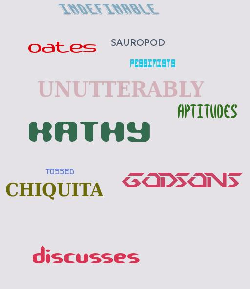

# Naive_text_dataset
A naive approach that generates random images and labels of text in simple colored background.
Dataset useful to train/test new prototypes of text detectors/recognizers. If the model does not learn with this dataset, it will not learn ever ! :)

# Examples:

